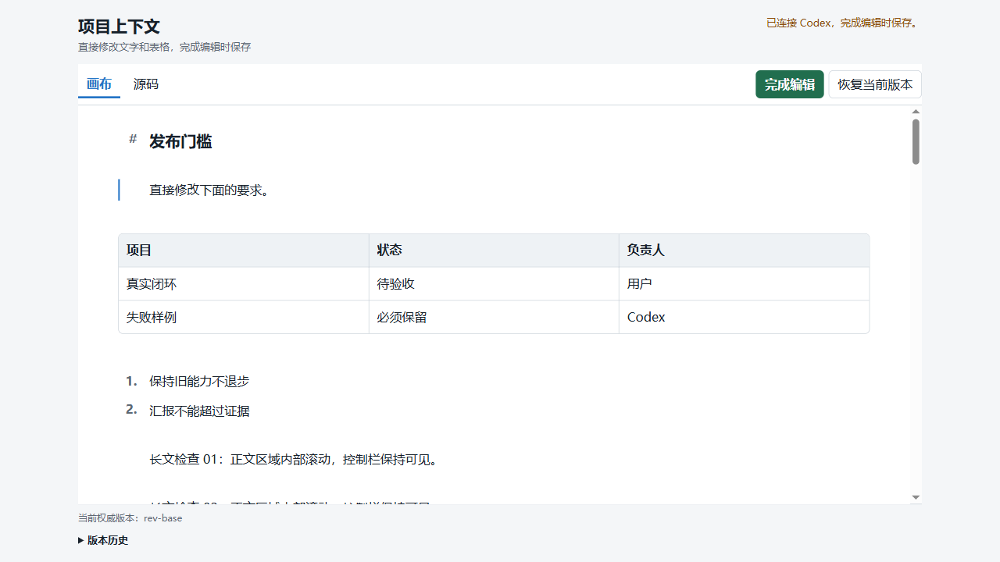

<h1 align="center">Codex Text Control</h1>

<div align="center">
  <p><strong>在 Codex 里直接修改当前权威上下文。检查完整原文后，再把一次确认保存成可追踪版本。</strong></p>
  <p>
    <a href="docs/evidence/verification-0.5.8-2026-09-01.md"></a>
    
    
    <a href="LICENSE"></a>
  </p>
  <p>
    <a href="#为什么需要它">为什么需要它</a> ·
    <a href="#快速开始">快速开始</a> ·
    <a href="#核心能力">核心能力</a> ·
    <a href="#验证现状">验证现状</a> ·
    <a href="#文档导航">文档导航</a>
  </p>
</div>



> 主画布外观基线：文字直接编辑、Markdown 表格单元格可直接修改、控制区在长文中保持可见。`0.5.7` 在真实 Codex 中完成了“编辑 -> 原文检查 -> 确认提交”闭环；`0.5.8` 又增加跨进程原子状态转换和未编辑原文保真，仍待重新安装后的真实宿主复验。

Codex Text Control 是一个本地 Codex 插件。它不改写已经显示的聊天消息，而是在项目内维护一份后续对话优先读取的权威 Markdown（轻量标记文本格式）。用户可以像改画布一样删、增、改文字和表格；编辑期间不写盘，只有检查完整原文并点击“确认提交”后，才生成一个不可变修订并更新权威指针。

> **当前状态：`0.5.8` 源码候选版。** `0.5.7` 已在当前 Windows Codex 桌面宿主完成核心点击闭环；`0.5.8` 的自动化、跨进程并发和原文保真检查已通过，但尚未重新安装进真实宿主。项目也还没有公开发行版、跨平台真实宿主结果或外部权威能力基准，因此这里不声称“生产可用”“领先同类”或“任何环境都能安装”。

## 为什么需要它

长对话里，同一条要求常常被重复解释、修正和补充。继续靠聊天追加会产生三个问题：最新版散落在多条消息里、表格很难精确改、模型为了保持上下文又会重复旧内容。

这个插件把“讨论”和“最终采用的上下文”分开：

1. Codex 把可继续采用或修改的结论稿放进画布。
2. 用户直接修改文字、表格或 Markdown 源码。
3. “完成编辑”先显示即将提交的完整原文，不立即保存。
4. “返回修改”保留草稿；“确认提交”才保存一个新版本。
5. 对话只收到版本号，后续回答再从项目文件读取全文。

结果是聊天保持简洁，项目仍有可检查、可恢复的完整上下文历史。

## 快速开始

### 在 Codex 中使用

对 Codex 说：

```text
打开当前权威上下文画布
```

然后完成一次闭环：

1. 在“画布”里直接改正文或表格；复杂 Markdown 可以切到“源码”。
2. 点击“完成编辑”。
3. 在弹窗中检查即将提交的完整原文。
4. 需要继续修改就点“返回修改”；确认无误后点“确认提交”。
5. 对话收到 `【上下文画布已更新】` 和版本号后，插件规则会要求 Codex 重新读取最新版。

编辑、停顿和中文输入法组合期间不会生成中间修订。没有实际修改时，也不会为了点击按钮制造重复版本。

### 从源码验证

当前还没有可供陌生用户使用的公开仓库地址和发行版，不能提供虚假的 `git clone` 或一键安装入口。拿到源码目录后，可执行：

```powershell
npm ci --ignore-scripts
npm run quality
npm run verify:candidate
```

- `npm ci --ignore-scripts`：使用 npm（Node 包管理器）严格按锁文件安装依赖，并禁用依赖安装脚本。
- `npm run quality`：运行自动测试、JavaScript 语法检查和 MCP（模型上下文协议）闭环探针。
- `npm run verify:candidate`：在质量检查之外，连接 npm 官方注册表检查生产依赖已知漏洞、包签名和来源证明。

已配置本机 `personal` 插件市场的开发者，可以安装当前本地构建：

```powershell
codex plugin add codex-text-control@personal
```

这条命令依赖本机个人市场配置，不是公开安装方式。

## 核心能力

| 能力 | 用户得到什么 | 明确边界 |
| --- | --- | --- |
| 直接编辑正文 | 点击文字即可修改，不出现覆盖整行的输入框 | 常用 Markdown 可视化；复杂语法用源码视图 |
| 编辑 Markdown 表格 | 直接修改单元格，最终仍保存为 Markdown | 不支持合并单元格、单元格内多行和嵌套表格 |
| 提交前原文检查 | 保存前查看完整待提交正文，可返回继续改 | 检查弹窗只读，不承担差异对比 |
| 不可变修订 | 每次确认保存完整快照，旧版本不被覆盖 | 当前没有真正的逐行差异视图 |
| 权威上下文指针 | 后续回答读取用户最后确认的版本 | 不能原地改写已经显示的历史消息 |
| 命名 AI 扩展点 | 只允许 AI 改指定块，块外由后端保持不变 | 重名、嵌套、缺失和过期基准会被拒绝 |
| 自动结论稿画布 | 方案、计划、规则、建议和验收稿可先进入画布 | 简短聊天、解释、日志、进度和文件交付不触发 |
| 项目级隔离 | 每次工具调用必须显式绑定当前工作区 | 当前没有对任意可写项目目录再做沙箱限制 |

## 触发范围

会打开画布的典型表达：

```text
直接改上下文
修改这个表格
我来改下
把讨论结果整理成可继续采用的方案
```

下面这些保持普通对话，不自动弹出画布：

```text
继续
解释一下
重启了
把代码写进文件
```

判断依据不是回复里有没有表格或编号，而是完整最终回复是否将成为后续要采用或继续修改的上下文。工作过程中的进度、命令输出、日志和报错始终不触发。

## 数据与边界

| 项目 | 说明 |
| --- | --- |
| 用途 | 直接维护项目级权威上下文，减少聊天重复和全文搬运 |
| 输入 | 当前项目目录、权威 Markdown、用户画布修改、可选命名扩展点 |
| 输出 | 完整不可变修订、更新后的权威指针、只含版本号的对话通知 |
| 依赖 | Node.js 22 或更高版本、Codex MCP Apps（MCP 应用）桥接、本地项目写权限 |
| 存储 | 使用项目内的 `.codex-text-control/`；没有网络上传逻辑 |
| 限制 | 本地文件未加密；状态转换只保证共享同一项目目录的本机进程一致；没有完整 CommonMark（通用 Markdown 规范）可视化 |

```text
.codex-text-control/
  authority-anchor.json  不可变的权威状态起点
  transitions/           每个权威状态最多一个后继转换
  state-proofs/          证明检查点属于权威状态链
  committed-revisions/   防止已提交修订编号被再次复用
  visible-revisions/     只向历史列表发布成功或显式保存的修订
  content-index/         按正文指纹定位修订，避免反复扫描历史
  revisions/             不可变完整 Markdown 快照
  current.json           兼容旧版本的可重建缓存
```

相同正文会复用已有修订，避免超时重试制造重复文件；并发失败候选不会出现在用户版本历史。载入历史版本只会把内容放回画布；再次确认后才生成新修订。卸载插件不会自动删除项目数据。

## 工作原理

```text
Codex 读取当前权威上下文
  -> 打开项目绑定的画布
  -> 用户修改文字、表格或源码
  -> 完成编辑并检查完整原文
  -> 用户确认提交
  -> 保存 revisions/<id>.json
  -> 排他发布 transitions/<state>.json
  -> 从 current.json 的链上检查点继续读取；缺失时从锚点恢复
  -> 尽力刷新兼容用 current.json
  -> 对话只收到版本号
  -> 后续回答重新读取当前权威内容
```

写工具标记为 `app-only`（仅应用可调用），模型可以读取和打开画布，但不能绕过用户确认直接保存。正文只通过 `textContent` 或表单 `value` 进入页面，不作为 HTML（网页标记语言）执行；Widget（小组件）的内容安全策略不允许外部网络、外部资源或嵌套页面。

## 项目结构

| 类别 | 位置 | 用途与客观评价 |
| --- | --- | --- |
| MCP 与存储代码 | `mcp/` | 校验输入、保存修订、用不可变状态转换解决同目录多进程竞争；不提供跨机器分布式事务 |
| 画布界面 | `ui/editor.html`、`ui/editor.js` | 负责视图、编辑和提交前检查，不直接操作文件 |
| Markdown 画布模型 | `ui/canvas-model.js` | 确定性解析和序列化；不依赖大模型，但只覆盖声明的常用语法 |
| 模型路由规则 | [`skills/codex-text-control/SKILL.md`](skills/codex-text-control/SKILL.md) | 决定何时打开画布和何时读取最新版；不能代替后端权限边界 |
| 自动测试 | `tests/` | 覆盖存储、表格、扩展点、交互、权限和失败恢复 |
| 可重复探针 | `scripts/probe-mcp.mjs` | 从 MCP 客户端侧检查公开工具闭环 |
| 设计与证据 | `docs/design/`、`docs/evidence/` | 设计决定和验证结果分开放置，避免把计划当成实测 |
| 模型、训练数据、论文 | 无 | 本项目不训练模型，也不把内部测试包装成论文或模型成绩 |

## 验证现状

以下是内部工程验证，不是外部权威基准：

| 层级 | 当前证据 | 能证明什么 | 不能证明什么 |
| --- | --- | --- | --- |
| 自动测试 | `74/74` 通过 | 已覆盖的存储、跨进程并发、历史恢复、原文保真、画布、权限和交互契约未失败 | 不能代替真实 Codex 宿主 |
| 重复稳定性 | 同一 `0.5.8` 候选连续 10 次，共 `740/740` 项通过，失败运行 `0` | 当前机器和样本下未观察到不稳定运行 | 不能证明长期运行永不失败 |
| 并发压力 | 修复前 6 个并行完整套件 `0/6` 通过；修复后 `6/6` 通过，共 `444/444` 项 | 已关闭“相同正文并发被误判为历史恢复”的已知竞态 | 只覆盖当前 Windows 本地文件系统和冻结压力形状 |
| MCP 探针与语法 | `npm run quality` 通过 | 工具协议、脚本语法和受控闭环一致 | 不能证明所有宿主版本兼容 |
| 干净克隆 | 全新本地克隆执行 `npm ci --ignore-scripts` 后，`74/74`、语法检查和 MCP 探针通过，工作树干净 | 结果不依赖开发目录已有 `node_modules` 或未跟踪源码 | 不是第二位用户或第二个操作系统的独立复现 |
| 真实宿主 | `0.5.7+codex.20260901154437` 在当前 Windows Codex 中完成“修改 -> 原文检查 -> 返回修改 -> 再检查 -> 确认提交 -> 回读” | 只证明最后一个已安装构建的当前环境闭环 | `0.5.8` 改过存储和画布模型，不能继承这项宿主结论 |
| 供应链检查 | 生产依赖已知高危漏洞 `0`，签名 `96`，来源证明 `11` | npm 当前数据源未报告对应问题 | 不能证明依赖没有未知漏洞 |
| 公开发布 | 未通过 | 当前没有公开远程仓库、线上持续集成或发行版 | 不能提供陌生用户安装和维护承诺 |

最新真实宿主提交版本为 `rev-1788249723947-c7d6a499`，对应 `0.5.7`。`0.5.8` 的并发失败复现、修复和原文保真结果见 [`0.5.8 验证记录`](docs/evidence/verification-0.5.8-2026-09-01.md)。当前缺少适用于“Codex 上下文画布”的外部权威能力基准，因此不能用 GitHub 星数、同类项目知名度或内部测试数量声称能力领先。

## 已知限制

- 不能原地修改已经显示的历史消息，只能维护后续优先读取的权威上下文。
- 未点击“确认提交”就关闭画布时，当前本地草稿不会写入版本历史，也不承诺恢复。
- 没有逐行差异视图、公开安全联系人或跨平台真实宿主证据；不可变状态转换不是跨机器分布式事务，网络文件系统语义尚未验证。
- 项目目录依赖 Codex 提供当前工作区；缺少目录时会明确拒绝，不会猜测或退回插件安装缓存。
- 当前只适合本地试用和继续验证，不等于已经完成公开发布准备。

## 文档导航

| 文档 | 读者与用途 |
| --- | --- |
| [`docs/design/README.md`](docs/design/README.md) | 维护者：全部当前与历史设计文档索引 |
| [`docs/design/architecture.md`](docs/design/architecture.md) | 维护者：系统边界、数据流、失败恢复和架构决定 |
| [`docs/design/context-canvas-0.5.4.md`](docs/design/context-canvas-0.5.4.md) | 维护者：取消实时保存和长文内部滚动的设计依据 |
| [`docs/evidence/README.md`](docs/evidence/README.md) | 评审者：全部验证、真实宿主、截图和调研证据索引 |
| [`docs/evidence/verification-0.5.8-2026-09-01.md`](docs/evidence/verification-0.5.8-2026-09-01.md) | 评审者：当前源码候选的并发、原文保真和自动化证据 |
| [`docs/evidence/verification-0.5.7-2026-09-01.md`](docs/evidence/verification-0.5.7-2026-09-01.md) | 评审者：最后一个已安装构建的真实宿主证据 |
| [`docs/evidence/real-host-multi-test-0.5.3-2026-09-01.md`](docs/evidence/real-host-multi-test-0.5.3-2026-09-01.md) | 评审者：真实多场景测试、失败项和后续修复来源 |
| [`docs/evidence/github-readme-benchmark-2026-09-01.md`](docs/evidence/github-readme-benchmark-2026-09-01.md) | 维护者：本次 GitHub README 对照来源与采用理由 |
| [`CHANGELOG.md`](CHANGELOG.md) | 用户：版本变化、验证状态和回退方法 |
| [`CONTRIBUTING.md`](CONTRIBUTING.md) | 贡献者：开发环境、检查命令和变更门槛 |
| [`SECURITY.md`](SECURITY.md) | 用户与安全研究者：安全边界、已知风险和报告现状 |

## 贡献与许可证

提交变更前请先运行 `npm run quality` 和 `npm run verify:candidate`，并按 [`CONTRIBUTING.md`](CONTRIBUTING.md) 记录已证实、未证实、失败项、限制和回退方法。

项目使用 [MIT 许可证](LICENSE)，另有[中文说明](LICENSE.zh-CN.md)。第三方依赖与许可证说明见 [`THIRD_PARTY_NOTICES.md`](THIRD_PARTY_NOTICES.md)。

客观评价：这个项目已经从“聊天里再复制一份全文”走到可实际点击的项目级上下文画布；并发覆盖和非目标全文重排也有失败复现与回归测试。它距离成熟公开项目仍差 `0.5.8` 真实宿主复验、公开安装、线上持续集成、跨平台复现、公开安全渠道和外部基准。README（仓库首页说明）只按证据说明当前阶段，不把文档完整度冒充产品成熟度。
