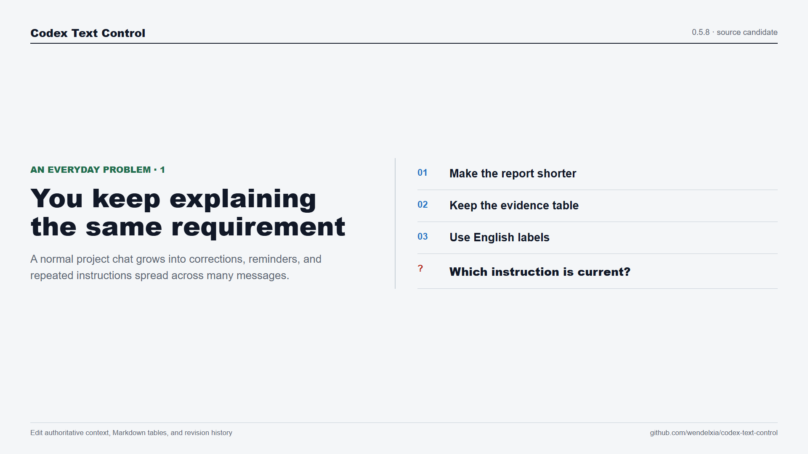

# Codex Text Control Overview

[](codex-text-control-overview.mp4)

**[Watch the English-narrated overview with Simplified Chinese subtitles](codex-text-control-overview.mp4)**

## Purpose

This media package starts with common problems from real project chats, then introduces Codex Text Control and demonstrates the complete user-confirmed workflow.

The problem section covers repeated requirements, a one-cell edit that causes a full rewrite, and uncertainty about which version the next answer should follow. The solution section then shows opening the canvas, editing text, editing one table cell, switching to Markdown source, reviewing the complete draft, returning without saving, confirming one immutable revision, receiving only the revision ID in chat, inspecting history, and re-reading the accepted revision before the next answer.

## Files

| File | Purpose | Input | Output |
| --- | --- | --- | --- |
| [`codex-text-control-overview.mp4`](codex-text-control-overview.mp4) | Main product overview | Rendered scenes, narration, and subtitles | 1920x1080 H.264 and AAC video |
| [`codex-text-control-overview-cover.png`](codex-text-control-overview-cover.png) | GitHub preview image | Intro scene | 1920x1080 PNG |
| [`codex-text-control-overview.zh-CN.ass`](codex-text-control-overview.zh-CN.ass) | Editable subtitle source | Human-reviewed Simplified Chinese scene subtitles and measured timing | Advanced SubStation Alpha subtitle file |
| [`transcript.en-zh-CN.md`](transcript.en-zh-CN.md) | Accessible text alternative | English narration and Simplified Chinese subtitles | Timestamped bilingual transcript |
| [`render-report.json`](render-report.json) | Reproducibility evidence | Source hashes, tool versions, media probes, and public artifacts | Machine-readable report |

## Reproduce

Run from the repository root on Windows:

```powershell
npm ci --ignore-scripts
npm run render:promo:github
```

Inputs are [`scripts/promo-content.mjs`](../../../scripts/promo-content.mjs), [`scripts/public-media-guard.mjs`](../../../scripts/public-media-guard.mjs), [`scripts/render-github-promo.mjs`](../../../scripts/render-github-promo.mjs), and the current files in [`ui/`](../../../ui/). Temporary frames, audio, and segments are written under the ignored `tmp/github-promo/` directory. Publication replaces this complete directory only after every check passes.

Dependencies are Node.js 22 or newer, Google Chrome, FFmpeg, FFprobe, Windows speech synthesis, an enabled English voice, and Microsoft YaHei for Simplified Chinese subtitles. The exact verified environment is recorded in [`render-report.json`](render-report.json).

## Verification

The render keeps visible UI, narration, filenames, metadata, and package copy on the English channel. A separate gate requires Chinese text in every subtitle and rejects unrelated scripts. The story-order check requires three everyday problem scenes before the tool appears. Every public artifact is bound to a byte size and SHA-256 digest in the report.

The verified GitHub Actions evidence is run [`33545397952`](https://github.com/wendelxia/codex-text-control/actions/runs/33545397952), commit `863c380cdc3f64707cab56e856f24785a76f5ec0`, observed 2026-09-02, with 5/5 jobs passing and conclusion `success`.

## Limits

- Product screens come from the current UI source with a simulated Codex bridge. They are labeled `UI demonstration · current source` and are not a real Codex host recording.
- English labels belong to the demonstration harness and do not claim product localization.
- Simplified Chinese subtitles are written and reviewed as text; the code-point gate cannot prove translation quality by itself.
- Version 0.5.8 remains a source candidate. The video does not claim production readiness, one-click installation, industry leadership, or cross-platform host support.
- The repository evidence supports 74/74 product tests before this media-only change, 5/5 jobs in the cited GitHub Actions run, and an MIT license. It does not provide an external authoritative capability benchmark for this workflow.
- Rendering is semantically reproducible, but compatible browser, voice, font, and codec versions may produce different bytes.

Objective assessment: the package now leads with recognizable user problems, explains what the tool changes, and then proves that explanation through the full workflow. It remains a source-generated demonstration, not independent user validation.
